# **项目概述**

本项目是一个面向开发者的 API 平台，提供 API 接口供开发者调用。用户通过注册登录，可以开通接口调用权限，并可以浏览和调用接口。每次调用都会进行统计，用户可以根据统计数据进行分析和优化。管理员可以发布接口、下线接口 、接入接口，并可视化接口的调用情况和数据。

## 业务流程

### **5个子系统：**

1. **模拟接口系统**：提供各种模拟接口供开发者使用和测试，例如，提供一个随机头像生成接口。
2. **后台管理系统**：管理员可以发布接口、设置接口的调用数量、设定是否下线接口等功能，以及查看用户使用接口的情况，例如使用次数，错误调用等。
3. **用户前台系统**：提供一个访问界面，供开发者浏览所有的接口，可以购买或开通接口，并获得一定量的调用次数。
4. **API 网关系统**：负责接口的流量控制，计费统计，安全防护等功能，提供一致的接口服务质量，和简化 API 的管理工作。
5. **第三方调用 SDK 系统**：提供一个简化的工具包，使得开发者可以更方便地调用接口，例如提供预封装的 HTTP 请求方法、接口调用示例等。

### **项目关键问题和挑战：**

1. **接口设计**：需要设计清晰易用的 API 接口，并且提供详细的接口文档，以方便开发者使用。
2. **性能和可用性**：平台需要承载大量的接口请求，因此需要考虑到性能和可用性问题。例如，设计高效的数据存储和检索策略，确保 API 网关的高性能等。
3. **安全**：平台需要防止各种安全攻击，例如 DDOS 攻击，也需要保护用户的隐私和数据安全。
4. **计费和流量控制**：需要设计合理的计费策略和流量控制机制，以确保平台的稳定运行和收入来源。
5. **易用性和用户体验**：需要为开发者提供简单易用的接口调用工具和友好的用户界面，提供优质的用户体验。

💡 **在调用这个接口时需要考虑以下问题：**

1. 需要考虑访问权限的问题：用户是否可以随意访问数据库和接口。
2. 需要添加计费功能，统计用户调用次数，并考虑限流或流量保护措施。
3. 需要考虑如何有效地管理用户。(例如，如果用户欠费或者是陌生人调用接口，我们需要及时发现并采取措施)

 **🧰 API 网关？**

API 网关的主要作用是为多个接口提供保护，并集中进行计费、健全日志等逻辑处理。类似于我们去火车站坐高铁一样，无论是去哪个站台坐哪个火车，都需要先通过检票口进行集中的检票。

与我们程序中的 AOP 不同，API 网关是一个独立的服务，需要单独开通。

🪔  **SDK？**

SDK 是软件开发工具包的缩写，是一种为软件开发者提供支持的一系列工具、接口和规范的集合。举个例子，比如腾讯云提供了一些接口，比如创建 VPC 等，如果开发者直接向腾讯云服务器发请求，需要输入密钥、做签名认证等操作，非常繁琐。因此，在构建第三方 API 平台时，一般都会提供一套 SDK，让使用者能够轻松地调用接口，无需自己编写和封装 HTTP 请求。可以把 SDK 理解为 Java 语法中的工具包，使用者只需要最少量的代码即可调用接口，如果不理解 SDK，需要加强 Java 语法的学习。

### 需求分析

**背景：**

1. 前端开发需要用到后台接口
2. 使用现成的系统的功能 - [免费API接口平台](http://api.btstu.cn/)

**做一个 API 接口平台：**

1. 管理员可以对接口信息进行增删改查
2. 用户可以访问前台,查看接口信息

**其他要求：**

1. 防止攻击(安全性)
2. 不能随便调用(限制、开通)
3. **统计调用次数**
4. 计费
5. 流量保护
6. API 接入

# 项目初始化

## 数据库表

### 接口信息表


| **接口信息表(interface_info)** |  |  |
| --- | --- | --- |
| **字段** | **说明** | **类型** |
| id | 用户 id(主键) | bigint |
| name | 名称 | varchar(256) |
| description | 描述 | varchar(256) |
| url | 接口地址 | varchar(512) |
| requestHeader | 请求头 | text |
| responseHeader | 响应头 | text |
| status | 接口状态（0-关闭，1-开启） | int |
| method | 请求类型 | varchar(256) |
| userId | 创建人 | bigint |
| createTime | 创建时间 | datetime |
| updateTime | 更新时间 | datetime |
| isDelete | 是否删除(0-未删, 1-已删) | tinyint |

```sql
-- 接口信息
create table if not exists yuapi.`interface_info`
(
  `id` bigint not null auto_increment comment '主键' primary key,
  `name` varchar(256) not null comment '名称',
  `description` varchar(256) null comment '描述',
  `url` varchar(512) not null comment '接口地址',
  `requestHeader` text null comment '请求头',
  `responseHeader` text null comment '响应头',
  `status` int default 0 not null comment '接口状态（0-关闭，1-开启）',
  `method` varchar(256) not null comment '请求类型',
  `userId` bigint not null comment '创建人',
  `createTime` datetime default CURRENT_TIMESTAMP not null comment '创建时间',
  `updateTime` datetime default CURRENT_TIMESTAMP not null on update CURRENT_TIMESTAMP comment '更新时间',
  `isDelete` tinyint default 0 not null comment '是否删除(0-未删, 1-已删)'
) comment '接口信息';

```

## 前端初始化

```jsx
# 安装脚手架
npm install -g @ant-design/pro-cli@3.1.0
# 安装 echarts
npm install --save echarts-for-react
```

**前端代码自动生成**

如何实现接口的自动生成：如果后端已经定义了各种接口，使用 oneapi 插件提供基于其规范的文档来同步这些信息。

简单地说，oneapi 是一种接口文档的规范，可以理解为接口文档的格式或者规则。举个例子，我们常用的 Swagger 这种后端接口文档，就是遵循了 openapi 规范。


使用openapi提供的json格式接口文档，在 `config.ts` 中引用提供的文档


运行 `package.json`中的 `"openapi": "max openapi"` 会自动生成文档

# 后端开发

## 模拟接口 qianapi-interface

先来真实地发布一个给开发者提供的接口，创建一个模拟接口项目提供三个模拟接口

1. GET
2. POST（url传参）
3. POST（restful传参）

```java
package com.qian.qianapiinterface.controller;
import com.qianapi.qianapiclientsdk.model.User;

@RestController
@RequestMapping("/name")
public class NameController {

    @GetMapping("/")
    public String getName(String name){
        return "名字为"+name;
    }

    @PostMapping("/")
    public String getNameByPost(@RequestParam String name) {
        return "POST 你的名字是" + name;
    }

    @PostMapping("/user")
    public String getUserName(@RequestBody User user){
        return "传参 名字为"+user.getName();
    }
}
```

在 application.yml 指定后端项目的端口号为 8123 ，指定全局接口地址，加一个 api前缀。

```yaml
server:
  port: 8123
  servlet:
    context-path: /api
```

启动项目，调用接口[http://localhost:8123/api/name/?name=wyx](http://localhost:8123/api/name/?name=yupi%E3%80%82) 调用的GET请求可以获得“名字为wyx”，但对于开发者来说，总不至于每次都在浏览器地址栏输入接口地址来调用，通常会选择在后端调用第三方 API，因为这样可以避免在前端暴露诸如密码这样的敏感信息。

### **调用接口的方式**

通常开发者在后端调用第三方API

**HTTP 调用方式：**

1. HttpClient
2. RestTemplate
3. 第三方库（OKHTTP、Hutool）

https://www.hutool.cn/docs/#/

```java
/**
 * 调用第三方接口的客户端
 */
public class QianApiClient {
    // 使用GET方法从服务器获取名称信息
    public String getNameByGet(String name) {
        // 可以单独传入http参数，这样参数会自动做URL编码，拼接在URL中
        HashMap<String, Object> paramMap = new HashMap<>();
        // 将"name"参数添加到映射中
        paramMap.put("name", name);
        // 使用HttpUtil工具发起GET请求，并获取服务器返回的结果
        String result= HttpUtil.get("http://localhost:8123/api/name/", paramMap);
        // 返回服务器返回的结果
        return result;
    }
    
    // 使用POST方法从服务器获取名称信息
    public String getNameByPost(@RequestParam String name) {
        // 可以单独传入http参数，这样参数会自动做URL编码，拼接在URL中
        HashMap<String, Object> paramMap = new HashMap<>();
        paramMap.put("name", name);
        // 使用HttpUtil工具发起POST请求，并获取服务器返回的结果
        String result= HttpUtil.post("http://localhost:8123/api/name/", paramMap);
        return result;
    }

    // 使用POST方法向服务器发送User对象，并获取服务器返回的结果
    public String getUserNameByPost(@RequestBody User user) {
        // 将User对象转换为JSON字符串
        String json = JSONUtil.toJsonStr(user);
        // 使用HttpRequest工具发起POST请求，并获取服务器的响应
        HttpResponse httpResponse = HttpRequest.post("http://localhost:8123/api/name/")
                .body(json) // 将JSON字符串设置为请求体
                .execute(); // 执行请求
        // 打印服务器返回的状态码
        System.out.println(httpResponse.getStatus());
        // 获取服务器返回的结果
        String result = httpResponse.body();
        // 返回服务器返回的结果
        return result;
    }
}

```

## API签名认证

我们为开发者提供了一个接口，却对调用者一无所知。如果攻击者疯狂地请求这个接口，会影响正常用户的使用。如果在后期业务扩大，可能还需要收费。因此，我们必须知道谁在调用接口，并且不能让无权限的人随意调用。

现在，我们需要设计一个方法，来确定谁在调用接口。在之前开发后端时，会利用session进行一些权限检查判断是否是管理员。但是调用者没有登录操作，该怎么做，这时候要用到AP签名认证的机制。

API 签名认证主要包括两个过程。第一个是签发签名，第二个是使用签名或校验签名。这就像一些短信接口的 key 一样。

1. 保证安全性，不能随便一个人调用
2. 适用于无需保存登录态的场景。只认签名，不关注用户登录态。

### 简单认证

- 给`QianApiClient` 增加`accessKey`与`secretKey`字段，创建一个私有方法，用于构造请求头在`HttpResponse` 中添加请求头

```java
public class QianApiClient {

    private String accessKey;

    private String secretKey;

    public YuApiClient(String accessKey, String secretKey) {
        this.accessKey = accessKey;
        this.secretKey = secretKey;
    }

    public String getNameByGet(String name) {

    }

    public String getNameByPost(@RequestParam String name) {

    }

    // 创建一个私有方法，用于构造请求头
    private Map<String, String> getHeaderMap() {
        // 创建一个新的 HashMap 对象
        Map<String, String> hashMap = new HashMap<>();
        // 将 "accessKey" 和其对应的值放入 map 中
        hashMap.put("accessKey", accessKey);
        // 将 "secretKey" 和其对应的值放入 map 中
        hashMap.put("secretKey", secretKey);
        // 返回构造的请求头 map
        return hashMap;
    }

    public String getUserNameByPost(@RequestBody User user) {
        String json = JSONUtil.toJsonStr(user);
        HttpResponse httpResponse = HttpRequest.post("http://localhost:8123/api/name/user")
                **// 添加前面构造的请求头**
                **.addHeaders(getHeaderMap())**
                .body(json)
                .execute();
        System.out.println(httpResponse.getStatus());
        String result = httpResponse.body();
        System.out.println(result);
        return result;
    }
}

```

- `NameController` 相当于后端，开发者调用user接口，请求的数据需要带上`accessKey`与`secretKey`字段

```java
@PostMapping("/user")
public String getUserNameByPost(@RequestBody User user, HttpServletRequest request) {
    // 从请求头中获取名为 "accessKey" 的值
    String accessKey = request.getHeader("accessKey");
    // 从请求头中获取名为 "secretKey" 的值
    String secretKey = request.getHeader("secretKey");
    // 如果 accessKey 不等于 "yupi" 或者 secretKey 不等于 "abcdefgh"
    if (!accessKey.equals("yupi") || !secretKey.equals("abcdefgh")){
        // 抛出一个运行时异常，表示权限不足
        throw new RuntimeException("无权限");
    }
    // 如果权限校验通过，返回 "POST 用户名字是" + 用户名
    return "POST 用户名字是" + user.getUsername();
}

```

### **接口防御措施：**

1. 请求的用户需求以及是否真实存在
    - **参数 1：**accessKey：调用的标识 userA, userB（复杂、无序、无规律）
    - **参数 2：**用户请求内容
2. 请求参数是否被篡改
    - **参数 3：**secretKey：密钥（复杂、无序、无规律）**该参数不能放到请求头中**
        
        (类似用户名和密码，区别：ak、sk 是无状态的，不会管之前来没来过)
        
    - **参数 4：**签名
        
        用户参数 + secretKey => 签名生成算法（MD5、HMac、Sha1） => 不可解密的值
        
        服务端用一模一样的（参数+secretKey）和算法去生成签名，只要和用户传的的一致，就表示请求是可信的
        
    
    <aside>
    ➡️
    
    请求携带参数AccessKey和Sign，只有拥有合法的身份AccessKey和正确的签名Sign才能放行。
    这样就解决了身份验证和参数篡改问题，即使请求参数被劫持，由于获取不到SecretKey（仅作本地加密使用，不参与网络传输），无法伪造合法的请求。
    
    </aside>
    
3. 是否存在重复请求
    - **参数 5：**nonce 指唯一的随机字符串，用来标识每个被签名的请求。
        
        防止重放攻击（记录所有用过的nonce以阻止它们被二次使用）
        
4. 请求发起时间得在限制范围内
    - **参数 6：** timestamp 时间戳（优化nonce的存储）
        
        将过期的nonce删除
        

<aside>
💡

AccessKey：用于身份验证

SecretKey：用于防止参数篡改

既要传递用户请求参数body（为了请求内容）也要传递（参数+secretKey）加密的内容 因为加密出的内容本身是不可逆的 取不出来body

</aside>

### 实现：通过 http request header 头传递参数。

基于secretKey**不能放到请求头中**、需要给请求参数加密、防止重放攻击与删除过期请求

对请求头数据进行修改

```java
/**
 * 签名工具
 */
public class SignUtils {
    /**
     * 生成签名
     * @param hashMap 包含需要签名的参数的哈希映射
     * @param secretKey 密钥
     * @return 生成的签名字符串
     */
    public static String genSign(Map<String, String> hashMap, String secretKey) {
        // 使用SHA256算法的Digester
        Digester md5 = new Digester(DigestAlgorithm.SHA256);
        // 构建签名内容，将哈希映射转换为字符串并拼接密钥
        String content = hashMap.toString() + "." + secretKey;
        // 计算签名的摘要并返回摘要的十六进制表示形式
        return md5.digestHex(content);
    }
}

```

- `QianApiClient` 添加相关安全措施

```java
/**
 * 获取请求头的哈希映射
 * @param body 请求体内容
 * @return 包含请求头参数的哈希映射
 */
private Map<String, String> getHeaderMap(String body) {
    Map<String, String> hashMap = new HashMap<>();
    hashMap.put("accessKey", accessKey);
    // 注意：不能直接发送密钥
    // hashMap.put("secretKey", secretKey);
    // 生成随机数(生成一个包含100个随机数字的字符串)
    hashMap.put("nonce", RandomUtil.randomNumbers(100));
    // 请求体内容
    hashMap.put("body", body);
    // 当前时间戳
    // System.currentTimeMillis()返回当前时间的毫秒数。通过除以1000，可以将毫秒数转换为秒数，以得到当前时间戳的秒级表示
    // String.valueOf()方法用于将数值转换为字符串。在这里，将计算得到的时间戳（以秒为单位）转换为字符串
    hashMap.put("timestamp", String.valueOf(System.currentTimeMillis() / 1000));
    // 生成签名
    hashMap.put("sign", **SignUtils.genSign**(body, secretKey));
    return hashMap;
}

/**
 * 通过POST请求获取用户名
 * @param user 用户对象
 * @return 从服务器获取的用户名
 */
public String getUserNameByPost(@RequestBody User user) {
    // 将用户对象转换为JSON字符串
    String json = JSONUtil.toJsonStr(user);
    HttpResponse httpResponse = HttpRequest.post("http://localhost:8123/api/name/user")
            // 添加请求头
            .addHeaders(getHeaderMap(json))
            // 设置请求体
            .body(json)
            // 发送POST请求
            .execute();
    // 打印响应状态码
    System.out.println(httpResponse.getStatus());
    // 打印响应体内容
    String result = httpResponse.body();
    System.out.println(result);
    return result;
}

```

- `NameController` 后端对发送过来的数据进行校验

```java
@PostMapping("/user")
public String getUserNameByPost(@RequestBody User user, HttpServletRequest request) {
    // 1.拿到这五个我们可以一步一步去做校验,比如 accessKey 我们先去数据库中查一下
    // 从请求头中获取参数
    String accessKey = request.getHeader("accessKey");
    String nonce = request.getHeader("nonce");
    String timestamp = request.getHeader("timestamp");
    String sign = request.getHeader("sign");
    String body = request.getHeader("body");
    // 不能直接获取秘钥
    //        String secretKey = request.getHeader("secretKey");

    // 2.校验权限,这里模拟一下,直接判断 accessKey 是否为"yupi",实际应该查询数据库验证权限
    if (!accessKey.equals("yupi")){
        throw new RuntimeException("无权限");
    }

    // 3.校验一下随机数,因为时间有限,就不带大家再到后端去存储了,后端存储用hashmap或redis都可以
    // 校验随机数,模拟一下,直接判断nonce是否大于10000
    if (Long.parseLong(nonce) > 10000) {
        throw new RuntimeException("无权限");
    }

    // 4 获取的时间戳-当前时间戳 如果大五分钟 表示超时
    if(Math.abs(Long.parseLong(timestamp) - System.currentTimeMillis()) > 5 * 60 * 1000){
        throw new RuntimeException("无权限");
    }
    
    // 5 校验secretKey 防止参数篡改
    // TODO 客户端的 secretKey 就是服务端签发的 实际应当去数据库中查找accessKey对应的
    String serverSign = SignUtils.genSign(body, "asdfghjkl");
    if(!sign.equals(serverSign)){
        throw new RuntimeException("无权限");
    }

    return "POST 用户名字是" + user.getUsername();
}
```

## 用户客户端SDK开发

**为什么需要 Starter？**

作为开发者，如果每次调用接口都需要生成时间戳，编写签名算法，生成随机数等等，对开发者不利。因此我们要想让开发者能够以最简单的方式调用接口，开发者只需要关心传递哪些参数以及他们的密钥、APP等信息，就跟调用自己写的代码一样简单。

开发 starter 的好处：开发者引入之后，可以直接在 application.yml 中写配置，自动创建客户端。

**进一步说明：**

为了方便开发者的调用，我们不能让他们每次都自己编写签名算法，这显然很繁琐。因此，我们需要开发一个简单易用的 SDK。实际上，RPC（远程过程调用）就是为了实现这一目的而设计的。

### starter

在这里我们看到引入 mybatis、redis、 swagger 接口文档的时候，都使用了 starter。

**优势：**

- 对于 Redis 的 starter，可以直接在 application.yml 配置文件中进行相关配置。我们可以在配置文件中简单地定义一个连接到 Redis 的配置块
- 对于 Swagger 接口文档，我们也可以在配置文件中进行相应的配置。

使用 starter 的好处就是，开发者引入后可以直接在 application.ym 中进行配置，自动创建相应的客户端。这样使得开发过程更加简单便捷，无需过多关注底层实现细节，而是专注于配置和使用。

```yaml
spring:
  application:
    name: qianapi-backend
  # DataSource Config
  datasource:
    driver-class-name: com.mysql.cj.jdbc.Driver
    url: jdbc:mysql://localhost:3306/qianapi
    username: root
    password: wyx232524
  # session 失效时间（分钟）
  session:
    timeout: 86400
    store-type: redis
  # redis 配置
  redis:
    port: 6379
    host: localhost
    database: 0
```

### 开发流程

- **`qianapi-client-sdk` 项目**
    - **修改 pom 文件的版本号，并删除 build**
    
    
    
    
    
    - 写`QianapiClientConfig`配置类
    
    目标是为用户生成一个可用的客户端对象，希望用户能够通过引入starter 的方式直接使用客户端，而不需要手动创建，所以我们需要编写一个配置类。
    
    ```java
    // 通过 @Configuration 注解,将该类标记为一个配置类,告诉 Spring 这是一个用于配置的类
    @Configuration
    // 能够读取application.yml的配置,读取到配置之后,把这个读到的配置设置到我们这里的属性中,
    // 这里给所有的配置加上前缀为"qianapi.client"
    @ConfigurationProperties("qianapi.client")
    // @Data 注解是一个 Lombok 注解,自动生成了类的getter、setter方法
    @Data
    // @ComponentScan 注解用于自动扫描组件，使得 Spring 能够自动注册相应的 Bean
    @ComponentScan
    public class QianapiClientConfig{
    
        private String accessKey;
    
        private String secretKey;
    
        @Bean
        public QianapiClient qianapiClient() {
            return new QianapiClient(accessKey, secretKey);
        }
    }
    ```
    
    - **写META-INF spring-factories**
        - META - INF 是一个标准的目录，用于存放应用程序相关的元数据（meta - data）。它是 Java 标准的一部分，主要用于存储那些不是 Java 类文件（.class 文件）的资源。这些资源包括但不限于配置文件、服务提供者配置等，用于对 Java 应用程序进行额外的定义和配置。
        - `spring - factories`文件位于 META - INF 目录下，主要用于实现 Spring Boot 中的自动配置功能，**能够自动加载并应用这些自动配置类**
        
        sdk中设置配置类 会自动根据设置 加载`QianapiClientConfig`配置类
        
        
        
        ```java
        # springboot starter  QianapiClientConfig
        org.springframework.boot.autoconfigure.EnableAutoConfiguration=com.qianapi.qianapiclientsdk.QianapiClientConfig
        ```
        
    - **@configurationProperties注解** [@ConfigurationProperties](https://www.notion.so/ConfigurationProperties-16552b323dd1803da239c84ac2f6c8dd?pvs=21)
- **`qianapi-interface` 项目-用于开发者调用接口测试**
    - **打包 引入sdk**
        - 🐛**BUG:** 不再支持源选项 5。请使用 8 或更高版本。
            - 添加如下两行
            
            
            
        
        **qianapi-client-sdk项目**
        
        
        
        - 打包后的maven包存放在.m2文件夹
        
        **qianapi-interface项目**
        
        
        
        
        
        用户引入了sdk项目后，可以直接使用`QianapiClient`，Spring Boot 将会在应用启动时自动加载和实例化 `QianapiClientConfig`，并将其应用于我们的**qianapi-interface**应用程序中。这样，我们就可以使用自动配置生成的 `QianapiClient`对象，而无需手动创建和配置。
        
        此外`QianapiClientConfig` 添加的 `@ConfigurationProperties("qianapi.client")` 会自动读取`application.yml`中的配置添加到`QianapiClient`属性中
        
        
        
- sdk
    
    配置类 `@ConfigurationProperties`外部配置绑定到java类上
    
    META-INF 添加 `spring - factories`自动加载配置类
    
- interface项目
    
    引入sdk
    
    `application.yml`配置
    
    使用提前配置的类
    

## 接口发布下线

**发布接口(仅管理员可操作)**

1. 校验该接口是否存在
2. 判断该接口是否可以调用
3. 修改接口数据库中的状态字段为 1

**下线接口(仅管理员可操作)**

1. 校验该接口是否存在
2. 修改接口数据库中的状态字段为 0

这两个接口其实只需接收接口 ìd 即可。比如，我想要发布 id 唯一的接口，只需传递这个id作为参数即可，这样就可以清楚地表示要对哪个接口进行发布操作。

新建一个通用的 IdRequest：就是封装了 id 这个参数，它将一个基本类型封装成一个对象，这样便于我们进行json 参数传递

```java
@Data
public class IdRequest implements Serializable {
    /**
     * id
     */
    private Long id;

    private static final long serialVersionUID = 1L;
}
```

- `InterfaceInfoController`中发布接口方法 主要也就分三部分
    - 判空判断是否存在接口
    - 判断接口是否有效 能否调用成功
    - 更新接口状态
        - 接口状态用0 1 表示 这种常数值写一个`enum`类表示

```java
    /**
     * 发布接口
     *
     * @param idRequest
     * @return
     */
    @PostMapping("/online")
    @AuthCheck(mustRole = "admin")
    public BaseResponse<Boolean> onlineInterfaceInfo(@RequestBody IdRequest idRequest) {

        if(idRequest == null || idRequest.getId() <= 0 ){
            throw new BusinessException(ErrorCode.PARAMS_ERROR);
        }
        // 判断是否存在
        long id = idRequest.getId();
        InterfaceInfo oldInterfaceInfo = interfaceInfoService.getById(id);
        if (oldInterfaceInfo == null) {
            throw new BusinessException(ErrorCode.NOT_FOUND_ERROR);
        }
        // 判断能否调用成功
        com.qianapi.qianapiclientsdk.model.User user = new com.qianapi.qianapiclientsdk.model.User();
        user.setUsername("wangyixuan");
        System.out.println(qianapiClient);
        String userName = qianapiClient.getUserName(user);
        if (StringUtils.isBlank(userName)){
            throw new BusinessException(ErrorCode.SYSTEM_ERROR,"接口验证失败");
        }

        // 修改接口状态
        InterfaceInfo interfaceInfo = new InterfaceInfo();
        interfaceInfo.setId(id);
        interfaceInfo.setStatus(InterfaceInfoStatusEnum.ONLINE.getValue());
        boolean result = interfaceInfoService.updateById(interfaceInfo);
        return ResultUtils.success(result);
    }
```

### 管理员权限

这两个接口只有管理员能调用，给接口打上注解：`@AuthCheck(mustRole = "admin")`

## 用户申请签名

- User类添加签名ak sk字段
- UserMapper文件添加签名字段
- UserServiceImpl 添加签名 逻辑

### 添加真实接口与补充参数

- 添加一个`getUserName`(qianapi-interface中)的接口
- 新增`requestParams`参数
    - 在实体类、request类、mapper中新增
    
    在线调用中有一个关键点，那就是确定请求参数的类型。通常用JSON 来作为请求参数的类型
    
    ```json
    [
        {"name": "username", "type": "string"}
        {请求参数名称, 请求参数类型}
    ]
    ```
    

## 在线调用接口开发

```mermaid
flowchart LR
    A[前端] -->|aaa.com/api| B[接口平台后端]
    B -->|bbbb.com/api| C[模拟接口]
```



前端不直接访问模拟接口，这样模拟接口的地址不用暴露给前端更加安全方便。

前端在调用接口时，首先将要调用的接口以及请求参数传递给后端，然后后端作为中转角色，再向模拟接口发送请求。除了中转功能，后端可能还需要进行一些判断，例如判断前端的测试频率是否过高，或者判断前端是否有权限进行该接口的测试。

前端要做的事情，就是把所有它要调用的接口 id、请求参数传给后端，后端负责调用。

### 开发测试调用接口

```java
/**
 * 测试调用
 *
 * @param interfaceInfoInvokeRequest 
 * @param request
 * @return
 */
@PostMapping("/invoke")
// 这里给它新封装一个参数InterfaceInfoInvokeRequest
// 返回结果把对象发出去就好了，因为不确定接口的返回值到底是什么
public BaseResponse<String> invokeInterfaceInfo(@RequestBody InterfaceInfoInvokeRequest interfaceInfoInvokeRequest,
                                                HttpServletRequest request) {
    // 检查请求对象是否为空或者接口id是否小于等于0
    if (interfaceInfoInvokeRequest == null || interfaceInfoInvokeRequest.getId() <= 0) {
        throw new BusinessException(ErrorCode.PARAMS_ERROR);
    }
    // 获取接口id
    long id = interfaceInfoInvokeRequest.getId();
    // 判断是否存在
    InterfaceInfo oldInterfaceInfo = interfaceInfoService.getById(id);
    if (oldInterfaceInfo == null) {
        throw new BusinessException(ErrorCode.NOT_FOUND_ERROR);
    }
    // 检查接口状态是否为下线状态
    if (oldInterfaceInfo.getStatus() == InterfaceInfoStatusEnum.OFFLINE.getValue()) {
        throw new BusinessException(ErrorCode.PARAMS_ERROR, "接口已关闭");
    }
    
}

```

在用户进行测试调用时，我们需要告知后端用户的签名信息，这样我们才能判断用户是否具有调用接口的权限。有三种方式：

1. 要求用户必须具有接口权限才能进行调用。
2. 即使用户没有权限，也允许其进行调用，以便体验接口功能。如果选择进行体验，建议为用户分配临时的签名，类似于测试环境，给予一定数量的调用次数。这可能需要新增两个字段，例如在数据库中添加一个测试次数字段，稍微复杂一些。
3. 可以直接为每个用户提供几十次调用机会

那我们这里的话就直接用他自己的账号了。

- 还是在上面的`invokeInterfaceInfo` 函数中

```java
// 获取当前登录用户的ak和sk，这样相当于用户自己的这个身份去调用，
// 也不会担心它刷接口，因为知道是谁刷了这个接口，会比较安全
String requestParams = interfaceInfoInvokeRequest.getRequestParams();
User loginUser = userService.getLoginUser(request);
String accessKey = loginUser.getAccessKey();
String secretKey = loginUser.getSecretKey();
// 我们只需要进行测试调用，所以我们需要解析传递过来的参数。
Gson gson = new Gson();
// 将用户请求参数转换为com.qianapi.qianapiclientsdk.model.User user对象
com.qianapi.qianapiclientsdk.model.User user = gson.fromJson(requestParams, 
                                                            com.qianapi.qianapiclientsdk.model.User.class);
// 创建一个临时的QianapiClient对象 传入ak sk 
//如果采用全局的qianapiClient会使用application中配置的管理员的ak sk
QianapiClient qianapiClient = new QianapiClient(accessKey, secretKey);
// 调用qianapiClient的getUserName方法
String userName = qianapiClient.getUserName(user);
return ResultUtils.success(userName);
```

相当于前端请求后端项目`qianapi-backend`中的`invokeInterfaceInfo` 方法，将接口id与请求参数封装（后端接收是一个`InterfaceInfoInvokeRequest`对象）以及`HttpServletRequest` （用于获取当前登录用户），然后通过`QianapiClient`调用接口。

### 接口调用统计

**需求:**

1. 用户每次调用接口成功，次数+1
2. 给用户分配或者用户自主申请接口调用次数

**业务流程:**

1. 用户调用接口(之前已完成)
2. 修改数据库，调用次数 +1

既然每次调用接口成功都要加1次数，那么需要区分是哪个用户调用了哪个接口，这意味着用户和接口之间是一个多对多的关系，设计一个"用户调用接口关系表”来存储用户和接口之间的关系。

主要有以下属性

| 用户id | 调用接口id | 总调用次数 | 剩余次数 | 状态 |
| --- | --- | --- | --- | --- |

**步骤：**

第一种情况是用户没有这个调用次数记录，那么我们需要创建一条新的记录。

第二种情况是用户已经有了调用次数记录，我们需要在现有的次数基础上加 1。

**实现：**

针对新的数据表 通过mybatis-plus创建新的model：实体类、dto，新的业务逻辑：controller、service、serviceImpl、mapper、mapper.xml等

在serviceImpl中实现调用次数+1功能，在controller中只要调用这个方法就可以实现调用次数+1

```java
@Override
    public boolean invokeCount(long userId, long interfaceInfoId){
        if (userId <= 0 || interfaceInfoId <= 0) {
            throw new BusinessException(ErrorCode.PARAMS_ERROR, "接口或用户不存在");
        }
        UpdateWrapper<UserInterfaceInfo> updateWrapper = new UpdateWrapper<>();
        updateWrapper.eq("userId", userId);
        updateWrapper.eq("interfaceInfoId", interfaceInfoId);
        // 保证剩余次数大于0
        updateWrapper.gt("leftNum", 0);
        updateWrapper.setSql("leftNum = leftNum - 1, totalNum = totalNum + 1");
        boolean result = this.update(updateWrapper);

        return result;
    }
```


# API网关

我们目前的项目有API接口平台、后端调用项目是一个多项目架构


假设一个普通用户想调用接口 A。操作:先调用接口 A，然后接口A再调用统计次数方法，接着调用接口 B，再去调用统计次数方法。


现在用户直接调用网关，由网关负责根据用户请求的地址，找到对应的接口，比如接口 A，然后调用接口 A，并在调用后统计次数加 1。同样，用户调用接口 B或接口C，也是先调用网关，然后网关再去找相应的接口并进行调用

通过这种设计，我们实现了一个统一的网关来处理不同项目的请求，用户和开发者都不需要关心具体的细节，简化了操作，提高了系统的可用性和可维护性。

### 场景

1. **路由**
    
    起到转发的作用，比如有接口 A和接口 B，网关会记录这些信息，根据用户访问的地址和参数，转发请求到对应的接口(服务器/集群)。
    /a =>接口A
    /b =>接口B
    
2. **负载均衡**
    
    在路由的基础上。
    
    /c => 服务 A / 集群 A（随机转发到其中的某一个机器）
    
3. **统一鉴权**
    
    判断用户是否有权限进行操作，无论访问什么接口，都统一去判断权限，不用重复写。
    
4. **统一处理跨域**
    
    网关统一处理跨域，不用在每个项目里单独处理。
    
5. **统一业务处理(缓存)**
    
    把一些每个项目中都要做的通用逻辑放到上层（网关），统一处理，比如本项目的次数统计。
    
6. **访问控制**
    
    黑白名单，比如限制 DDOS IP。
    
7. **发布控制**
    
    灰度发布，比如上线新接口，先给新接口分配 20% 的流量，老接口 80%，再慢慢调整比重。
    
    https://docs.spring.io/spring-cloud-gateway/docs/current/reference/html/#the-weight-route-predicate-factory
    
8. **流量染色（记录请求是否是网关来的）**
    
    给请求（流量）添加一些标识，一般是设置请求头中，添加新的请求头。
    
    1. 全局染色 [Spring Cloud Gateway](https://docs.spring.io/spring-cloud-gateway/docs/current/reference/html/#default-filters)
9. **接口保护**
    1. 限制请求
    2. 信息脱敏——[the-removerequestheader-gatewayfilter-factory](https://docs.spring.io/spring-cloud-gateway/docs/current/reference/html/#the-removerequestheader-gatewayfilter-factory)
    3. 降级(熔断)——[fallback-headers](https://docs.spring.io/spring-cloud-gateway/docs/current/reference/html/#fallback-headers)
    4. 限流—— [the-requestratelimiter-gatewayfilter-factory](https://docs.spring.io/spring-cloud-gateway/docs/current/reference/html/#the-requestratelimiter-gatewayfilter-factory) 学习令牌桶算法、学习漏桶算法，学习一下 RedisLimitHandler
    5. 超时时间——[http-timeouts-configuration](https://docs.spring.io/spring-cloud-gateway/docs/current/reference/html/#http-timeouts-configuration)
10. **统一日志**
    
    统一的请求、响应信息记录。
    
11. **统一文档**
    
    将下游项目的文档进行聚合，在一个页面统一查看。
    

### 网关分类

1. 全局网关（接入层网关）：更多的是针对请求，作用是负载均衡、请求日志等，不和业务逻辑绑定。
    
    全局网关的主要功能是负载均衡，将大量的请求平均分摊到系统中的多台机器上。它通常不涉及过多的业务逻辑，而更注重处理请求日志等任务。
    
2. 业务网关（微服务网关）：会有一些业务逻辑，作用是将请求转发到不同的业务 / 项目 / 接口 / 服务。
    
    业务网关则更多地关注业务逻辑，例如统计次数、请求鉴权等，同时也会负责转发请求到具体的业务处理单元。
    

[微服务网关选型：5种主流 API 网关](https://zhuanlan.zhihu.com/p/500587132)

**例子：**

Nginx（全局网关）、Kong 网关（API 网关，[**Kong**](https://github.com/Kong/kong)），编程成本相对高一点。

Spring Cloud Gateway（取代了 Zuul）性能高、可以用 Java 代码来写逻辑，适于学习。

[Kong API 网关详解与实践](https://blog.csdn.net/qq_21040559/article/details/122961395)

## Spring cloud gateway

假设你做了一个电商系统，有三个微服务：

```java
localhost:9001/user       -> 处理用户相关接口
localhost:9002/product    -> 处理商品相关接口
localhost:9003/order      -> 处理订单相关接口
```

你想让用户通过一个统一的入口访问，比如：

```java
localhost:8080/user/**     => 转发到 localhost:9001/user/**
localhost:8080/product/**  => 转发到 localhost:9002/product/**
localhost:8080/order/**    => 转发到 localhost:9003/order/**
```

你只要用 Spring Cloud Gateway 配一个规则，就可以实现这些功能了。

```yaml
# application.yml
server:
  port: 8080

spring:
  cloud:
    gateway:
      routes:
        - id: user-service
          uri: http://localhost:9001
          predicates:
            - Path=/user/**
        - id: product-service
          uri: http://localhost:9002
          predicates:
            - Path=/product/**
        - id: order-service
          uri: http://localhost:9003
          predicates:
            - Path=/order/**
```

这个配置的意思是：

- 当用户访问 `/user/**` 开头的路径时，Gateway 自动转发到 `localhost:9001`
- `/product/**` 转到 `localhost:9002`
- `/order/**` 转到 `localhost:9003`

**组成：**

- **路由：**根据什么条件，转发请求到哪里
    - `.route`
- **断言：**一组规则、条件，用来确定如何转发路由
    - `r -> r.path("/path")`
    - `predicates:
      - Path=/user/**`
- **过滤器：**对请求进行一系列的处理，比如添加请求头、添加请求参数

```java
@SpringBootApplication
public class DemogatewayApplication {
    @Bean
    public RouteLocator customRouteLocator(RouteLocatorBuilder builder) {
        return builder.routes()
                .route("path_route", r -> r.path("/path")
                        .uri("http://httpbin.org"))
                .route("host_route", r -> r.host("*.myhost.org")
                        .uri("http://httpbin.org"))
                .build();
    }
}
```


**请求流程**

1. Gateway Client客户端发起请求
2. Handler Mapping：根据断言，去将请求转发到对应的路由
3. Web Handler：处理请求（一层层经过过滤器）
4. 实际调用服务

### 两种配置方式

1. 配置式
2. 编程式

### Handler Mapping

Path Route：如果你访问的地址是以对应路径作为前缀的，那么就给你访问到对应的地址。

XForwarded Remote Addr Route，这个功能允许我们从请求头中获取 X-Forwarded-Remote-Addr 这个字段，如果它的值是 192.168.1.1/24，那么就会将请求重定向到地址 [https://example.org。](https://example.org./)

Query Route，通过它可以根据查询条件进行路由匹配，比如说你的请求参数中包含一个名为 "green" 的查询参数，那它就会匹配到这个地址。

Remoteaddr Route，它允许我们根据远程地址来进行路由匹配。比如访问用户的 IP 地址是 192.168.1.1/24，就重定向到指定的地址 [https://example.org。](https://example.org./)

- 配置不同的路由 但不知道使用了哪条规则 可以设置打印日志

```yaml
logging:
  level:
    org.springframework:
      cloud.gateway: trace
```

将springframework中的gateway日志级别设置为最低

### Web Handler（过滤器 拦截器）对请求进行一些操作

- AddRequestHeader
    
    ```yaml
    spring:
      cloud:
        gateway:
          routes:
            - id: path_route
              uri: http://localhost:8123
              predicates:
                - Path=/api/name/**
              filters:
                - AddRequestHeader=myheader, hahaha
    ```
    
    当访问[localhost:8090/api/name/gate](http://localhost:8090/api/name/gate)会重定向到[http://localhost:8123/api/name/gate](http://localhost:8123/api/name/gate)
    
    添加一个请求头 myheader 值是 hahaha 后端可以通过`request.getHeader("myheader")`
    
- AddRequestParameter
    
    添加请求参数
    
- DedupeResponseHeader
    
    请求经过了多个服务器，每个服务器都添加了一层跨域头。但是由于重复添加跨域头，可能导致最终跨域失败并出现错误。为了解决这个问题，我们可以使用 DedupeResponseHeader 来去除重复的响应头。
    

## 网关开发

### 业务逻辑

1. 用户发送请求到API网关
2. 请求日志
3. 黑白名单
4. API网关鉴权（ak sk）
5. 判断接口是否存在
6. **请求转发，调用模拟接口**
7. 响应日志
8. 调用成功，接口调用次数+1
9. 调用失败，返回一个规范的错误码

### 请求转发

接口地址为 [localhost:8123/api/name/get?name=wangyixuan](http://localhost:8123/api/name/get?name=wangyixuan)

可以用一个前缀路由器 匹配/api路径 localhost:8123/api/**

比如请求网关：localhost:8090/api/name/get?name=wyx

转发到：localhost:8123/api/name/get?name=wyx

```yaml
server:
  port: 8090
spring:
  cloud:
    gateway:
      routes:
        - id: api_route
          uri: http://localhost:8123
          predicates:
            - Path=/api/**
```

- **全局过滤器**
    
    对全部的请求进行统一处理
    
    ```java
    @Slf4j
    @Component
    public class CustomGlobalFilter implements GlobalFilter, Ordered {
    
        @Override
        public Mono<Void> filter(ServerWebExchange exchange, GatewayFilterChain chain) {
            log.info("custom global filter");
            return chain.filter(exchange);
        }
    
        @Override
        public int getOrder() {
            return -1;
        }
    }
    ```
    
    `Ordered`表示多个过滤器的顺序
    
    ```java
        @Override
        public Mono<Void> filter(ServerWebExchange exchange, GatewayFilterChain chain) {
            // 1. 请求日志
            ServerHttpRequest request = exchange.getRequest();
            log.info("请求唯一标识：" + request.getId());
            log.info("请求路径：" + request.getPath().value());
            log.info("请求方法：" + request.getMethod());
            log.info("请求参数：" + request.getQueryParams());
            String sourceIp = request.getRemoteAddress().getHostString();
            log.info("请求来源地址：" + request.getRemoteAddress());
            log.info("请求来源地址：" + request.getLocalAddress().getHostString());
    
            ServerHttpResponse serverHttpResponse = exchange.getResponse();
            // 2. 访问控制 - 黑白名单
            if(!IP_WHITE_LIST.contains(sourceIp)){
                serverHttpResponse.setStatusCode(HttpStatus.FORBIDDEN);
                return serverHttpResponse.setComplete();
            }
            log.info("IP在白名单中，放行");
    
            // 3. API网关鉴权（ak sk）
            HttpHeaders headers = request.getHeaders();
            String access = headers.getFirst("accessKey");
            String body = headers.getFirst("body");
            String timestamp = headers.getFirst("timestamp");
            String nonce = headers.getFirst("nonce");
            String sign = headers.getFirst("sign");
    
            // TODO 实际情况是去数据库中查是否已分配给用户
            if(!"access".equals(access)){
                return handleNoAuth(serverHttpResponse);
            }
            //获取的时间戳 - 当前时间戳 如果大五分钟 表示超时
            final Long FIVE_MINIUTES = 5 * 60 * 1000L;
            if(Math.abs(Long.parseLong(timestamp) - System.currentTimeMillis()) > FIVE_MINIUTES){
                return handleNoAuth(serverHttpResponse);
            }
            if(Long.parseLong(nonce)>10000){
                return handleNoAuth(serverHttpResponse);
            }
            // TODO 客户端的 secretKey 就是服务端签发的 实际应当去数据库中查找accessKey对应的
            String serverSign = SignUtils.genSign(body, "asdfghjkl");
            if(!sign.equals(serverSign)){
                return handleNoAuth(serverHttpResponse);
            }
            // 4. 判断请求的接口是否存在
            // todo 从数据库查询模拟接口是否存在
    
            // 5. 请求转发，调用模拟接口
            Mono<Void> filter = chain.filter(exchange);
    
            // 6. 响应日志
            return handleResponse(exchange, chain);
    
    //        // 7. 调用成功，接口调用次数+1
    //        if(serverHttpResponse.getStatusCode() == HttpStatus.OK){
    //
    //        }
    //        // 8. 调用失败，返回一个规范的错误码
    //        else{
    //            serverHttpResponse.setStatusCode(HttpStatus.INTERNAL_SERVER_ERROR);
    //            return serverHttpResponse.setComplete();
    //        }
    //
    //        // 这里表示正常放行
    //        return filter;
        }
    ```
    

### 异步调用

预期是等模拟接口调用完成，才记录响应日志、统计调用次数。但现实是 chain.filter 方法立刻返回了，直到 filter 过滤器 return 后才调用了模拟接口。原因是:chain.filter 是个异步操作，理解为前端的 promise

[响应式编程](https://www.notion.so/1f352b323dd180a68947c405f20367a3?pvs=21) 

## 统计功能开发

统计调用数量前三的接口信息，返回给前端。

**后端流程：**

获取调用次数最多的几个接口，接口调用数量在`user_interface_info`表中，通过sql语句查询到`userInterfaceInfo`的List，但是list中只有接口的id，然后再在`inerface_info`表中查到接口信息形成list返回给前端

```sql
select interfaceInfoId, sum(totalNum) as totalNum
from user_interface_info
group by interfaceInfoId
order by totalNum desc
limit 3;
```

- 所以过程主要两步，首先从`user_interface_info`表获取调用数量最多的几个list，将list按照接口id分组，使用接口id作为键构造查询器查询`inerface_info`表，这样就查到调用数量最多的几个接口信息。
    
    ```java
    /**
     * 分析控制器
     */
    @RestController
    @RequestMapping("/analysis")
    @Slf4j
    public class AnalysisController {
    
        @Resource
        private UserInterfaceInfoMapper userInterfaceInfoMapper;
    
        @Resource
        private InterfaceInfoService interfaceInfoService;
        
        /**
         * 获取调用次数最多的接口信息列表。
         * 通过用户接口信息表查询调用次数最多的接口ID，再关联查询接口详细信息。
         *
         * @return 接口信息列表，包含调用次数最多的接口信息
         */
        @GetMapping("/top/interface/invoke")
        @AuthCheck(mustRole = "admin")
        public BaseResponse<List<InterfaceInfoVO>> listTopInvokeInterfaceInfo() {
            // 查询调用次数最多的接口信息列表
            List<UserInterfaceInfo> userInterfaceInfoList = userInterfaceInfoMapper.listTopInvokeInterfaceInfo(3);
            // 将接口信息按照接口ID分组，便于关联查询
            Map<Long, List<UserInterfaceInfo>> interfaceInfoIdObjMap = userInterfaceInfoList.stream()
                    .collect(Collectors.groupingBy(UserInterfaceInfo::getInterfaceInfoId));
            // 创建查询接口信息的条件包装器
            QueryWrapper<InterfaceInfo> queryWrapper = new QueryWrapper<>();
            // 设置查询条件，使用接口信息ID在接口信息映射中的键集合进行条件匹配
            queryWrapper.in("id", interfaceInfoIdObjMap.keySet());
            // 调用接口信息服务的list方法，传入条件包装器，获取符合条件的接口信息列表
            List<InterfaceInfo> list = interfaceInfoService.list(queryWrapper);
            // 判断查询结果是否为空
            if (CollectionUtils.isEmpty(list)) {
                throw new BusinessException(ErrorCode.SYSTEM_ERROR);
            }
            // 构建接口信息VO列表，使用流式处理将接口信息映射为接口信息VO对象，并加入列表中
            List<InterfaceInfoVO> interfaceInfoVOList = list.stream().map(interfaceInfo -> {
                // 创建一个新的接口信息VO对象
                InterfaceInfoVO interfaceInfoVO = new InterfaceInfoVO();
                // 将接口信息复制到接口信息VO对象中
                BeanUtils.copyProperties(interfaceInfo, interfaceInfoVO);
                // 从接口信息ID对应的映射中获取调用次数
                int totalNum = interfaceInfoIdObjMap.get(interfaceInfo.getId()).get(0).getTotalNum();
                // 将调用次数设置到接口信息VO对象中
                interfaceInfoVO.setTotalNum(totalNum);
                // 返回构建好的接口信息VO对象
                return interfaceInfoVO;
            }).collect(Collectors.toList());
            // 返回处理结果
            return ResultUtils.success(interfaceInfoVOList);
        }
    }
    
    ```
    

# 分布式改造

如何调用其他项目的方法例如HTTP请求与RPC 两者的区别是面试热点

**HTTP 请求怎么调用？**

- 提供方开发一个接口（地址、请求方法、参数、返回值）
- 调用方使用 HTTP Client 之类的代码包去发送 HTTP 请求

**RPC（Remote Procedure Call）**

- 作用：像调用本地方法一样调用远程方法。

**和直接 HTTP 调用的区别：**

1. 对开发者更透明，减少了很多的沟通成本。
2. RPC 向远程服务器发送请求时，未必要使用 HTTP 协议，比如还可以用 TCP / IP，性能更高。（内部服务更适用）。

## Dubbo

**两种使用方式：**

1. Spring Boot 代码（注解 + 编程式）：写 Java 接口，服务提供者和消费者都去引用这个接口。
2. IDL（接口调用语言）：创建一个公共的接口定义文件，服务提供者和消费者读取这个文件。优点是跨语言，所有的框架都认识。

Dubbo底层用的是 Triple 协议：

## Nacos

```bash
# Linux/Unix/Mac
sh startup.sh -m standalone

# ubuntu
bash startup.sh -m standalone

# Windows
startup.cmd -m standalone
```

## **抽象公共服务**

- `qianapi-gateway`项目中需要使用一些如下涉及数据库操作的功能，但是与数据库操作只在`qianapi-backend` 项目操作，于是可以将一些功能抽象出来作为公共`service`，在`qianapi-backend` 项目实现`serviceImpl` ，通过dubbo提供功能
    - *实际情况是去数据库中查是否已分配给用户*
    - *从数据库查询模拟接口是否存在*
    - *调用成功 接口调用次数+1 invokecount*

**步骤：**

1. 新建干净的 maven 项目，只保留必要的公共依赖
2. 抽取 service 和实体类
3. install 本地 maven 包
4. 让服务提供者引入 common 包，测试是否正常运行
5. 让服务消费者引入 common 包

### [Dubbo](https://www.notion.so/Dubbo-1e452b323dd180d097c5cf4cc4807154?pvs=21)

- 将公共服务接口抽象到`qianapi-common` 项目
- `qianapi-backend` 项目实现例如`InnerInterfaceInfoServiceImpl`接口，打上`@DubboService`注解，配置如下
    
    ```yaml
    dubbo:
      application:
        # 设置应用的名称
        name: dubbo-springboot-demo-provider
        qos-enabled: true
        qos-port: 22222
        qos-access-forbidden: false
      # 指定使用 Dubbo 协议，且端口设置为 -1，表示随机分配可用端口
      protocol:
        name: dubbo
        port: 22221
      registry:
        # 配置注册中心为 Nacos，使用的地址是 nacos://localhost:8848
        id: nacos-registry
        address: nacos://localhost:8848
    ```
    
    ```xml
    <dependency>
       <groupId>com.qian</groupId>
       <artifactId>qianapi-common</artifactId>
       <version>0.0.1</version>
    </dependency>
    ```
    
- 消费者`qianapi-gateway`项目可以通过dubbo直接使用提供者的服务
    
    ```java
    @DubboReference
    private InnerUserService innerUserService;
    
    @DubboReference
    private InnerInterfaceInfoService innerInterfaceInfoService;
    
    @DubboReference
    private InnerUserInterfaceInfoService innerUserInterfaceInfoService;
    ```
    

# 部署

**后端：**

- backend 项目：web 项目，部署 spring boot 的 jar 包（对外的）
- gateway 网关项目：web 项目，部署 spring boot 的 jar 包（对外的）
- interface 模拟接口项目：web 项目，部署 spring boot 的 jar 包（不建议对外暴露的）

```yaml
project-root/
├── backend/
│   ├── qianapi-backend-0.0.1-SNAPSHOT.jar
│   └── Dockerfile
├── gateway/
│   ├── gateway-0.0.1-SNAPSHOT.jar
│   └── Dockerfile
├── interface/
│   ├── interface-0.0.1-SNAPSHOT.jar
│   └── Dockerfile
└── docker-compose.yml
```

- qianapi-backend dockerfile 其他项目类似

```java
# Docker 镜像构建
FROM maven:3.5-jdk-8-alpine as builder

# Copy local code to the container image.
WORKDIR /app
COPY qianapi-backend-0.0.1-SNAPSHOT.jar /app/qianapi-backend-0.0.1-SNAPSHOT.jar

# Run the web service on container startup.
CMD ["java","-jar","/app/qianapi-backend-0.0.1-SNAPSHOT.jar","--spring.profiles.active=prod"]

```

- docker-compose.yml

```yaml
version: '3.8'
services:
  backend:
    build:
      context: ./backend
    container_name: qianapi-backend
    ports:
      - "7529:7529"
    restart: always

  gateway:
    build:
      context: ./gateway
    container_name: qianapi-gateway
    ports:
      - "8090:8090"
    restart: always

  interface:
    build:
      context: ./interface
    container_name: qianapi-interface
    ports:
      - "8123:8123"
    restart: always

```

- 打包命令
    
    ```bash
    docker-compose up --build -d
    ```
    
    **⚠️与单个打包的区别在于，docker-compose可以统一管理多个 Docker 容器服务**
    
     `build` 字段就相当于
    
    ```bash
    cd backend
    docker build -t qianapi-backend:v0.0.1 .
    ```
    
- 启动docker
    
    ```bash
    docker run -d -p 7529:7529 qianapi-backend
    docker run -d -p 8090:8090 qianapi-gateway
    docker run -d -p 8123:8123 qianapi-interface
    ```